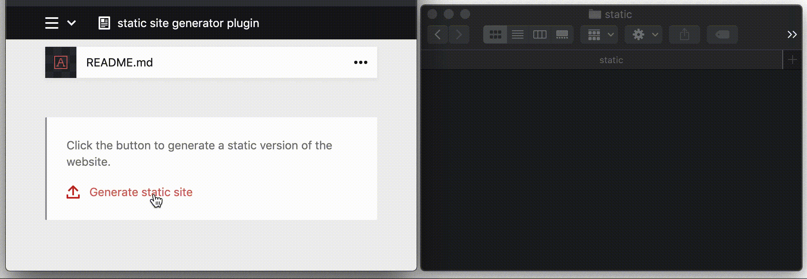

# Kirby 3+ - Static Site Generator

 

With this plugin you can create a directory with assets, media and static html files generated from your pages. You can simply upload the generated files to any CDN and everything (with small exceptions, see below) will still work. The result is an even faster site with less potential vulnerabilities.

## Example



## What is Kirby?

[Kirby](https://getkirby.com) is a highly [customizable](https://getkirby.com/docs/guide/blueprints/introduction) and [file-based](https://getkirby.com/docs/guide/database) CMS (content management system). Before using this plugin make sure you have [installed](https://getkirby.com/docs/guide/installation) the latest version of Kirby CMS and are familiar with the [plugin basics](https://getkirby.com/docs/guide/plugins/plugin-basics).

## How to install the plugin

If you use composer, you can install the plugin with: `composer require d4l/kirby-static-site-generator`

Alternatively, create a `static-site-generator` folder in `site/plugins`, download this repository and extract its contents into the new folder.

## What works

- Compatibility with multilanguage sites
- Translated URLs
- Assets
- Media (also when resized; files are automatically generated and copied when used)
- Customizable base URL
- Customizable paths to copy
- Customizable output folder
- Preserve individual files / folders in the output folder
- Custom routes (click [here](#custom-routes) for more information)
- Custom pages filtering (click [here](#custom-filters) for more information)

## What doesn't work

- Dynamic routes (unless when called by custom route - click [here](#custom-routes) for more information)
- Query parameters (unless processed by javascript)
- Redirections / `die` or `exit` in the code (this also affects the compatibility with some other plugins)
- Kirby paginations (only manual paginations via custom routes)
- Directly opening the html files in the browser with the file protocol (absolute base url `/`)
- Compatibility with other plugins that work with the `file::version` and `file::url` components

## How to use it

### 1) Directly (e.g. from a kirby hook)

```php
$staticSiteGenerator = new D4L\StaticSiteGenerator($kirby, $pathsToCopy = null, $pages = null);
$fileList = $staticSiteGenerator->generate($outputFolder = './static', $baseUrl = '/', $preserve = []);
```

- `$pathsToCopy`: if not given, `$kirby->roots()->assets()` is used; set to `[]` to skip copying other files than media
- `$pages`: if not given, all pages are rendered
- use `$preserve` to preserve individual files or folders in your output folder, e.g. if you want to preserve a `README.md` in your output folder, set `$preserve`to `['README.md']`; any files or folders directly in the root level and starting with `.` are always preserved (e.g. `.git`)
- The `D4L\StaticSiteGenerator` class offers a couple of public methods that allow to make further configuration changes.

### 2) By triggering an endpoint

To use this, adapt config option `d4l.static_site_generator.endpoint` to your needs (should be a string)

### 3) By using a `static-site-generator` field

Do the same as for option 2) and then add a `staticSiteGenerator` type field to one of your blueprints:

```yaml
fields:
  staticSiteGenerator:
    label: Generate a static version of the site
    # ... (see "Field options")
```

## Available configuration options

```php
return [
    'd4l' => [
      'static_site_generator' => [
        'endpoint' => null, # set to any string like 'generate-static-site' to use the built-in endpoint (necessary when using the blueprint field)
        'output_folder' => './static', # you can specify an absolute or relative path
        'preserve' => [], # preserve individual files / folders in the root level of the output folder (anything starting with "." is always preserved)
        'base_url' => '/', # if the static site is not mounted to the root folder of your domain, change accordingly here
        'skip_media' => false, # set to true to skip copying media files, e.g. when they are already on a CDN; combinable with 'preserve' => ['media']
        'skip_templates' => [], # ignore pages with given templates (home is always rendered)
        'custom_routes' => [], # see below for more information on custom routes
        'custom_filters' => [], # see below for more information on custom filters
        'ignore_untranslated_pages' => false, # set to true to ignore pages without an own language
        'index_file_name' => 'index.html' # you can change the directory index file name, e.g. to 'index.json' when generating an API
      ]
    ]
];
```

All of these options are only relevant if you use implementation options 2) or 3).
When directly using the `D4L\StaticSiteGenerator` class, no config options are required.
In that case, options like `skip_media` can be achieved by calling `$staticSiteGenerator->skipMedia(true)`.

## Field options

```yaml
label: Generate static site
help: Custom help text
progress: Custom please-wait message
success: Custom success message
error: Custom error message
```

## Custom routes

You can also use this plugin to render custom routes. This way, e.g. paginations can be created programmatically.

Custom routes are passed as an array. Each item must contain at least a `path` property and if the path does not match a route, either the `page` or `route` property must be set.

Here is an example array, showing the different configuration options:

```php
$customRoutes = [
  [ // minimal configuration to render a route (must match, else skipped)
    'path' => 'my/route',
  ],
  [ // minimal configuration to render a page
    'path' => 'foo/bar',
    'page' => 'some-page-id'
  ],
  [ // advanced configuration to render a route (write to different path)
    'path' => 'sitemap.xml',
    'route' => 'my/sitemap/route'
  ],
  [ // advanced configuration to render a page
    'path' => 'foo/baz',
    'page' => page('some-page-id'),
    'languageCode' => 'en',
    'baseUrl' => '/custom-base-url/',
    'data' => [
      'foo' => 'bar'
    ]
  ]
];
```

Only `GET` routes without `language` scope are supported (you can of course add multiple custom routes for multiple languages). Patterns and action arguments are supported.

`page` is provided as a string containing the page ID, or as a page object.

If `languageCode` is not provided, the given page is rendered in the default language.

If `baseUrl` is not provided, the default base url is taken.

`path` may also end with a file name, in which case the given file is created instead of using the `<path>/index.html` schema.

To pass custom data to the controller or template, use `data`. [Click here](https://getkirby.com/docs/guide/templates/controllers#arguments-from-page-render-in-route) for more information how to use it.

⚠️ Have a look [here](https://getkirby.com/docs/reference/system/options/ready) in case you want to dynamically generate the custom routes based on a specific page or point to pages in the config. Kirby comes with a `ready` option for this purpose.

### There are two ways to define custom routes:

#### 1) Directly, when using this plugin directly

```php
$staticSiteGenerator->setCustomRoutes($customRoutes);
```

#### 2) Via configuration, when using the endpoint or `static-site-generator` field

```php
'd4l.static_site_generator.custom_routes' => $customRoutes
```

## Custom filters

When using the endpoint or `static-site-generator` field, this plugin will by default render all pages and subpages (using `pages()->index()`).
You can filter the pages to be rendered by providing an array of custom filters in config option `custom_filters`.

```php
'd4l.static_site_generator.custom_filters' => $customFilters
```

Each element of this array must be an array of arguments accepted by [`$pages->filterBy()` method](https://getkirby.com/docs/cookbook/content/filtering).
Here is an example array, showing some filters you could use (not exhaustive):

```php
$customFilters = [
  ['slug', '==', 'foo'], // will render page if its slug is exactly 'foo'
  ['url', '!*=', 'bar'], // will render page if its url doesn't contain 'bar'
  ['uri', '*', '/[1-9]/'], // will render page if its uri match regex '/[1-9]/'
  ['depth', '>', '2'], // will render page if its depth is greater than 2
  ['category', 'bar'], // will render page if its value in 'category' field is 'bar' ('category' being a single value field)
  ['tags', 'bar', ','], // will render page if its value in 'tags' field includes 'bar' ('tags' being a field accepting a comma-separated list of values)
  ['date', 'date >', '2018-01-01'], // will render page if its date is after '2018-01-01'
];
```

⚠️ Here again, you can use [Kirby's `ready` option](https://getkirby.com/docs/reference/system/options/ready) to dynamically generate the custom filters.

## Warnings

Be careful when specifying the output folder, as the given path (except files starting with `.`) will be erased before the generation! There is a safety check in place to avoid accidental erasure when specifying existing, non-empty folders.

## Contribute

Feedback and contributions are welcome!

For commit messages we're following the [gitmoji](https://gitmoji.dev/) guide :smiley:
Below you can find an example commit message for fixing a bug:
:bug: fix copying of individual files

Please post all bug reports in our issue tracker.
We have prepared a template which will make it easier to describe the bug.
